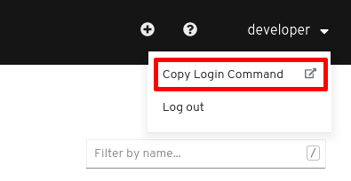
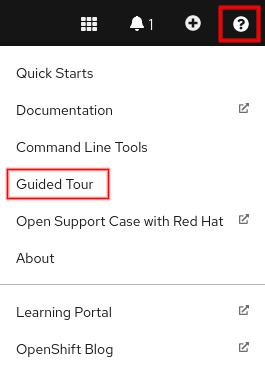
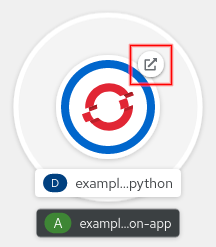

In this lab, we will familiarize ourselves with OpenShift 4's new web console.

{}
Please make sure you completed [the setup](../../setup/) before you continue with this lab.
{}


## Login


### Login on the Web Console

{}
Your trainer will provide you with the credentials and URLs to log in.
{}

Open your browser, open the OpenShift cluster URL and log in using the provided credentials.


### Login on the command line

In order to log in on the command line, copy the login command from the Web Console.

To do that, open the Web Console and click on your username you see at the top right, then choose **Copy Login Command**.



A new tab or window opens in your browser.

{}
You might need to login again.
{}

The page now displays a link **Display token**.
Click it and copy the command under **Log in with this token**.

Now paste the copied command on the command line.


### Verify login

If you now execute `oc version` you should see something like this (version numbers may vary):

```
Client Version: 4.6.9
Server Version: 4.6.9
Kubernetes Version: v1.19.0+7070803
```


## Web Console

Let's familiarize ourselves with OpenShift's new Web Console.
One main difference in OpenShift 4 is that there are two different **views**: A Developer view and an Administrator view.
Both show basically the same content but in a different way.
Chances are that you will prefer one over the other, independent from what role you have or what work you do.


### Task {}.1: Developer view guided tour

The view can be chosen by clicking on the button that either says **Developer** or **Administrator**.
Make sure you chose the **Developer** view.

OpenShift offers a very quick guided tour: Click on the question mark button on the top right and choose **Guided Tour**.




### Task {}.2: Create a Project

As a next step, create a Project:

* Click on **+Add** in the menu on the left
* In the center top to the left, there is a dropdown showing you the Project that is active
* Click on this dropdown and choose **Create Project**
* Choose an identifying name for your Project (e.g. your initials or name as a prefix)

{}
We are going to use `<project>` as a placeholder for your created Project.
{}


### Task {}.3: Deploy an image

After creating your Project, you are presented with a view that shows you different ways to create an application.

* Choose **Container Image**
* Use `quay.io/acend/example-web-python` as the image name
* Under **Advanced Options**, click on **Routing** and tick the checkbox **Secoure Route**
* Choose **Edge** as **TLS Termination**
* Choose **Redirect** for **Insecure Traffic**
* Click on the button **Create** on the bottom of the page

You are now presented with the **Topology** view of your project where you can see the progress of your Pod's deployment.
As soon as the Pod has been successfully deployed, click on the Pod's arrow icon on the top right.



The application's website should now appear.


### Task {}.4: Explore the Developer view

Explore the **Developer** view further:

* Show the Pod's logs
* Show the Project's Secrets
* Show the **Deployment Details**
* ...


### Task {}.4: Explore the Administrator view

Switch into the **Administrator** view.

* Try to find your Project and all its details
* Create a PersistentVolumeClaim with a size of 1GiB
* ...
