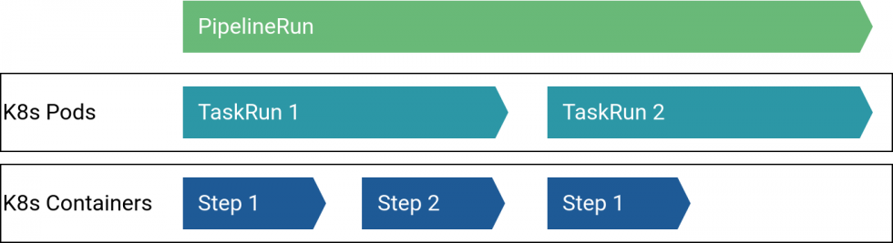
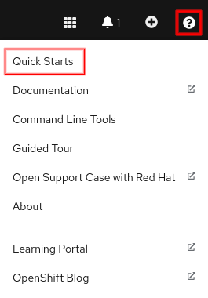

OpenShift 4 introduced OpenShift Pipelines. OpenShift Pipelines are based on [Tekton](https://tekton.dev/), a cloud native CI/CD solution.
In this lab, we are going to have a quick look at how it works by doing OpenShift's Quick Start tutorial.


## Basic Concepts

Tekton makes use of several Kubernetes [custom resource definitions (CRD)](https://kubernetes.io/docs/concepts/extend-kubernetes/api-extension/custom-resources/):

* *[Task](https://github.com/tektoncd/pipeline/blob/master/docs/tasks.md)*: A collection of steps that perform a specific task
* *[Pipeline](https://github.com/tektoncd/pipeline/blob/master/docs/pipelines.md)*: A series of tasks, combined to work together in a defined (structured) way
* *[TaskRun](https://github.com/tektoncd/pipeline/blob/master/docs/taskruns.md)*: The execution and result of running an instance of a task
* *[PipelineRun](https://github.com/tektoncd/pipeline/blob/master/docs/pipelineruns.md)*: The actual execution of a whole Pipeline, containing the results of the pipeline (success, failed...)

For each Task, a Pod will be allocated and for each step inside this task, a Container will be used.




### Task {}.1: Start the Quick Start

With OpenShift 4.6, Red Hat introduced so-called _Quick Starts_.
Quick Starts are tutorials for speicific topics that advise and explain what to do.

Click on the question mark button on the top right and choose **Quick Starts**.



You are presented with several Quick Start tutorials.
Choose the one titled **Deploying an application with a pipeline** and execute the steps outlined by the tutorial.

{}
Create a new Project for the Quick Start tutorial.
Choose an identifying name, e.g. `-pipeline` with your initials or name as prefix.
{}


### Task {}.2: Explore the custom resources

Explore the different custom resources that have been created, e.g. with:

```bash
oc get tasks --namespace <namespace>
```

More information on OpenShift Pipelines can be found in the [documentation](https://docs.openshift.com/container-platform/4.6/pipelines/understanding-openshift-pipelines.html).
